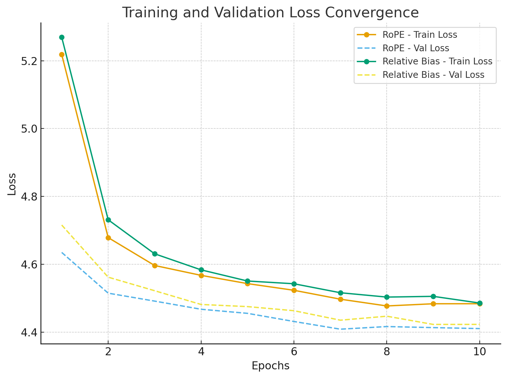

# Report

# Translation Accuracy Analysis

## BLEU Score Results

The table below summarizes the BLEU scores obtained across different decoding strategies and positional encoding methods:

| Model          | Decoding Strategy     | BLEU Score |
|----------------|-----------------------|------------|
| **RoPE**       | Greedy                | 0.0485     |
|                | Beam Search (5)       | 0.0484     |
|                | Beam Search (10)      | 0.0446     |
|                | Top-k (10, 1.0)       | 0.0390     |
|                | Top-k (50, 1.0)       | 0.0410     |
|                | Top-k (10, 0.8)       | 0.0405     |
|                | Top-k (50, 0.8)       | 0.0425     |
| **Relative Bias** | Greedy             | 0.0485     |
|                | Beam Search (5)       | 0.0468     |
|                | Beam Search (10)      | 0.0472     |
|                | Top-k (10, 1.0)       | 0.0328     |
|                | Top-k (50, 1.0)       | 0.0345     |
|                | Top-k (10, 0.8)       | 0.0338     |
|                | Top-k (50, 0.8)       | 0.0352     |

---

## Impact of Decoding Strategies on Accuracy

- **Greedy vs Beam Search**  
  - Both strategies perform similarly well, achieving BLEU scores around **0.048**.  
  - For RoPE, greedy decoding and beam search (beam=5) perform nearly identically, while a larger beam size (10) actually results in a slight drop in performance (0.0446).  
  - For Relative Bias, beam search with width 10 (0.0472) slightly improves over beam width 5 (0.0468), but both remain close to greedy decoding (0.0485).  
  - Overall, **deterministic decoding methods are stable**, but larger beam widths do not guarantee improvement and may even reduce accuracy.

- **Top-k Sampling**  
  - Performance drops significantly, with BLEU scores around **0.033–0.042**, far below greedy/beam search.  
  - Increasing *k* from 10 to 50 improves results slightly, and lowering the temperature (1.0 → 0.8) also adds a small gain.  
  - Despite these adjustments, **stochastic sampling strategies remain substantially weaker** in translation accuracy compared to deterministic methods.

---

## Conclusion

- **Greedy decoding remains the most reliable strategy**, especially for RoPE where beam search fails to offer consistent improvements.  
- **Beam search** provides marginal benefits for Relative Bias but is inconsistent for RoPE.  
- **Top-k sampling** consistently underperforms, reaffirming that stochastic decoding is less effective for maximizing BLEU scores, though it may serve other goals like generating more diverse translations.

---

# Convergence Speed 

## Training and Validation Loss Curves

## Analysis

- **RoPE Encoding**
  - Starts with slightly lower training and validation loss compared to Relative Bias.
  - Converges faster, stabilizing around **epoch 6–7**.
  - Final validation loss reaches about **4.41**, slightly better than Relative Bias.

- **Relative Bias Encoding**
  - Begins with higher loss values and declines more slowly.
  - Shows slower convergence, with fluctuations persisting until the last epochs.
  - Final validation loss remains around **4.42**, marginally worse than RoPE.

## Conclusion

- **RoPE converges faster** and achieves **slightly lower final loss values** compared to Relative Bias.  
- This suggests that RoPE provides more efficient optimization and improved training stability in this setup.

**Link to Pretrained Models** – 
https://iiithydstudents-my.sharepoint.com/:u:/g/personal/vanarasi_vamseedhar_students_iiit_ac_in/EcB_ukfonWtEk98a03vVbQcB_QMextL49yVQDbD2bFKNeg?e=nTJdOh
